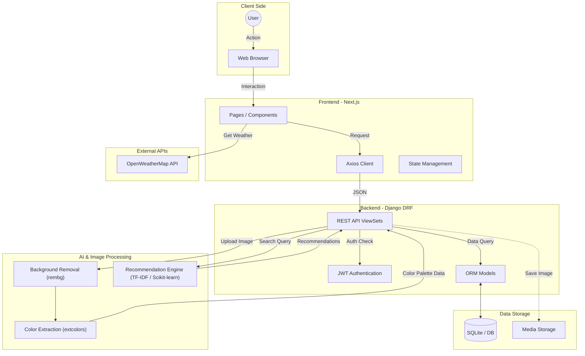

# 🎨 MOFY (My Outfit For You)

> **"나만의 색을 찾고, 스타일을 공유하다."**
>
> **퍼스널 컬러 분석 기반의 패션 커뮤니티 & 중고 거래 플랫폼**

 

## 📖 프로젝트 소개 (Project Overview)

**MOFY**는 단순한 중고 의류 거래를 넘어, 사용자들이 소통하며 자신만의 패션 스타일을 발견하고 발전시킬 수 있도록 돕는 **커뮤니티형 중고 거래 플랫폼**입니다.

특히, **AI 이미지 분석 기술**을 도입하여 사용자가 업로드한 사진에서 **'퍼스널 컬러 팔레트'**를 자동으로 추출해 주는 차별화된 기능을 제공합니다. 이를 통해 사용자는 자신의 스타일을 객관적으로 파악하고, 추출된 데이터를 바탕으로 더 감각적인 패션 스타일링과 거래를 할 수 있도록 지원했습니다.

 

## 🏗 시스템 아키텍처 (System Architecture)

전체 서비스의 데이터 흐름 요약입니다.

1.  **Client:** 사용자 (Web Browser)
2.  **Frontend (Next.js):** UI/UX 구성, Axios를 통한 API 요청, 상태 관리
3.  **Backend (Django DRF):** REST API 서버, JWT 인증, DB 제어
4.  **AI Services:**
    * **이미지 처리:** Rembg(배경 제거) -> Extcolors(색상 추출)
    * **추천 엔진:** Scikit-learn(TF-IDF/Cosine Similarity) 기반 검색어 추천
5.  **Database:** SQLite (개발용), Media Storage (이미지 저장)
6.  **External API:** OpenWeatherMap (날씨 기반 추천)

 

## 🌟 핵심 기능 (Key Features)

### 1. 🎨 AI 퍼스널 컬러 팔레트 추출
* **이미지 분석 파이프라인:** 사용자가 패션 사진을 업로드하면 `rembg` 라이브러리를 통해 배경을 제거하고, `extcolors`를 사용하여 의상의 주요 색상을 추출합니다.
* **스타일 객관화:** 추출된 색상 데이터를 시각적인 팔레트로 제공하여, 사용자가 자신의 옷이 어떤 컬러 톤인지 직관적으로 확인할 수 있습니다.

### 2. 👗 커뮤니티 & 마켓 (Community & Market)
* **스타일 공유 (OOTD):** 데일리룩을 공유하고 좋아요/댓글로 소통하며 스타일 랭킹에 도전할 수 있습니다.
* **중고 거래:** 입지 않는 옷을 판매하거나 취향에 맞는 옷을 구매할 수 있으며, 일반 커뮤니티 글과 거래 글을 `boardType`으로 명확히 구분하여 제공합니다.

### 3. 🔍 스마트 검색 및 추천 (Smart Search)
* **개인화 추천:** `Scikit-learn`의 TF-IDF 알고리즘을 활용하여 사용자의 검색 기록을 분석하고, 관심사와 유사한 키워드 및 스타일을 추천합니다.
* **날씨 기반 추천:** `OpenWeatherMap API`와 연동하여 현재 위치의 날씨와 기온에 적합한 옷차림을 제안합니다.

### 4. 🔒 사용자 관리 및 편의성
* **안전한 인증:** `SimpleJWT`를 사용한 토큰 기반 인증 시스템으로 보안성을 높였습니다.
* **신체 정보 관리:** 키, 몸무게, 신발 사이즈 등 패션 거래에 필수적인 정보를 체계적으로 관리하여 사이즈 실패 없는 거래를 돕습니다.

 

## 🛠 기술 스택 (Tech Stack)

### Frontend
| Tech | Description |
| :--- | :--- |
| **Framework** | Next.js (React) |
| **Language** | JavaScript (ES6+) |
| **Styling** | Styled-components, Ant Design |
| **Network** | Axios |

### Backend
| Tech | Description |
| :--- | :--- |
| **Framework** | Django REST Framework (DRF) |
| **Language** | Python 3.9+ |
| **Database** | SQLite (Dev) |
| **Authentication** | JWT (SimpleJWT) |

### AI & Data Processing
| Tech | Description |
| :--- | :--- |
| **Image Processing** | Rembg (Background Removal), PIL (Pillow) |
| **Color Analysis** | Extcolors |
| **Recommendation** | Scikit-learn (Cosine Similarity, TF-IDF) |
